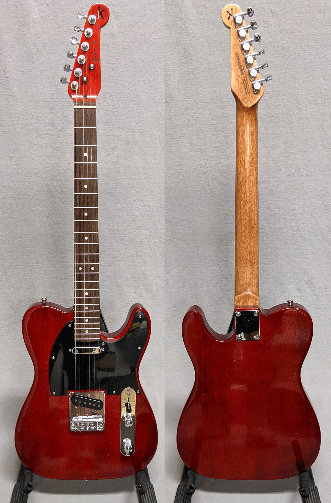
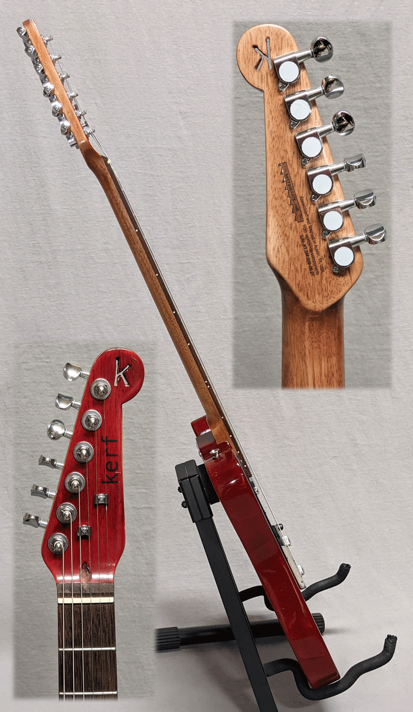

On sale for $200 as part of our Anniversary/President's Day/Valentine's Day combo mashup sale. Guitar only. 

This one's a real cherry, Cherry Red, that is. Every time I walk in the shop, my eyes are drawn to it.
I love seeing that dark grain under that transparent cherry tint. The black and silver accents definitely 
the right call.

It's your basic Tele-style guitar, setup beautifully. Our neighbor (who is in the jazz guitar program at UT, "hook 'em!")
almost didn't want to give it back after checking it out for us. It is based on <a href="https://www.stewmac.com/kits-and-projects/instrument-kits/electric-guitar-kits/t-style-electric-guitar-kit" target="_blank"> this kit with finishing set</a> from Stew Mac. Price is $275 and includes premium gig bag.

