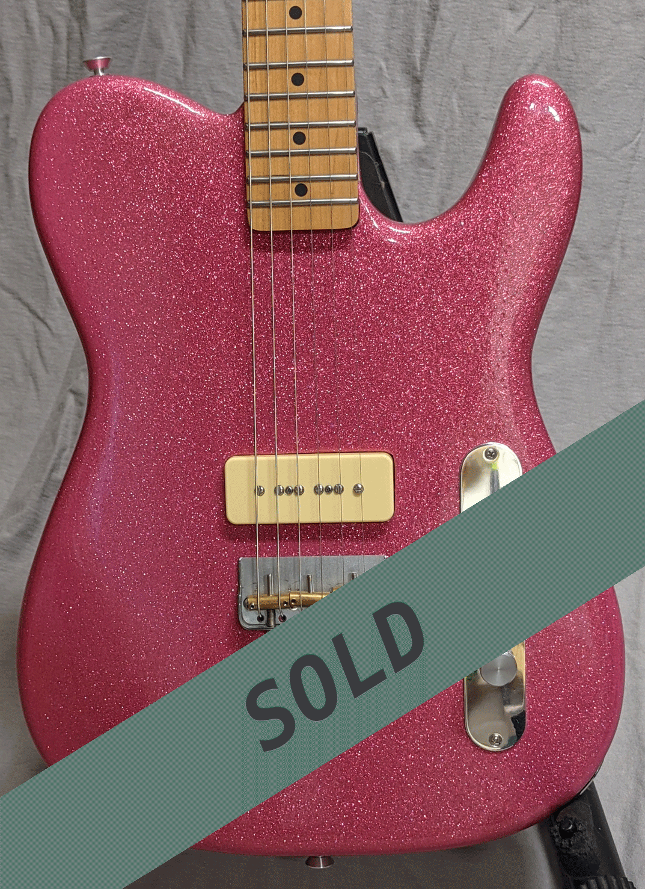

The "Drag Queen": This one is not an original kerf but has been given the kerf treatment. 
We bought it from a maker on the Facebook marketplace for $300. It had good bones 
(Fender licensed neck and tuners, brass saddles, and a sweet Tonerider pickup) but was 
a bit unattractive (finish already chipping, ferrules were not in line, 
had an odd, unnecessary pick guard and had some string/fret buzz). 

We took it apart, stripped and refinished the body in that gorgeous pink sparkle and fixed the buzz. 
That finish cost about $50 (pink, pink glitter and 2k ultra clear). Price is $375 with premium gig bag (see blog).

Availalbe now -- use Contact Form to request more details.

