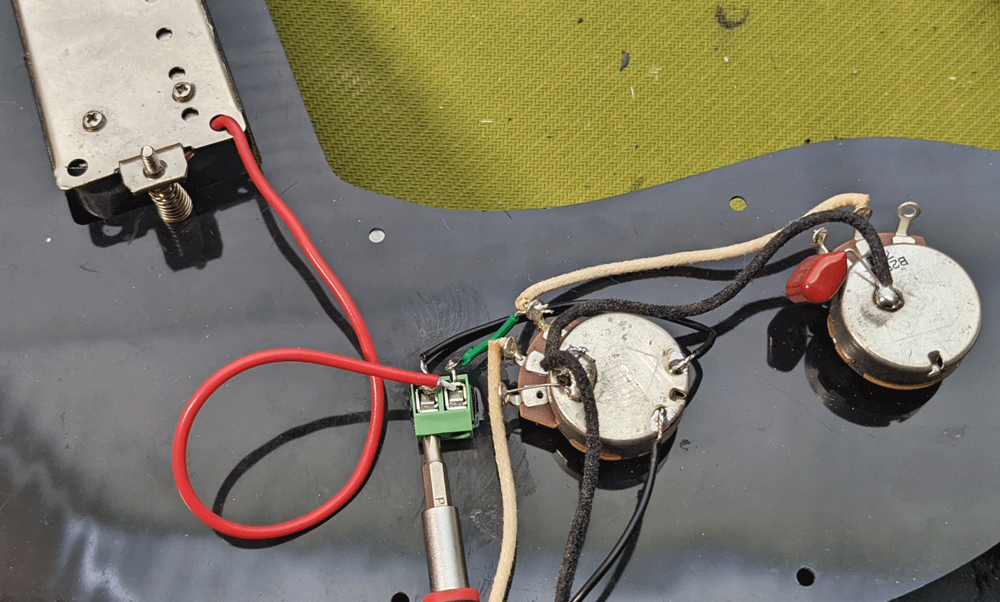
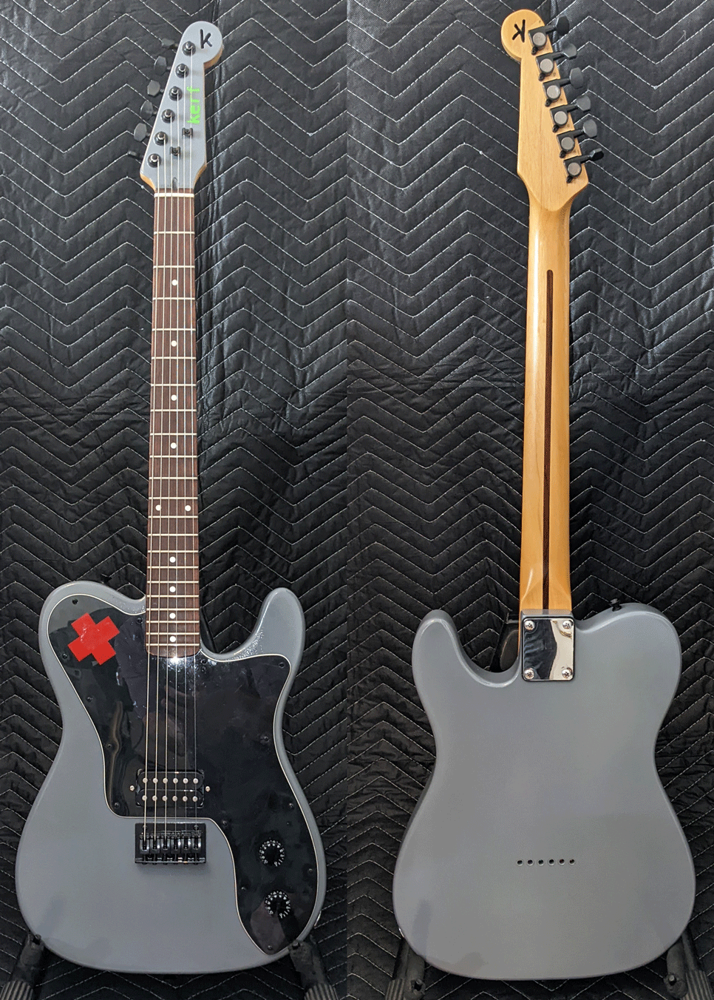
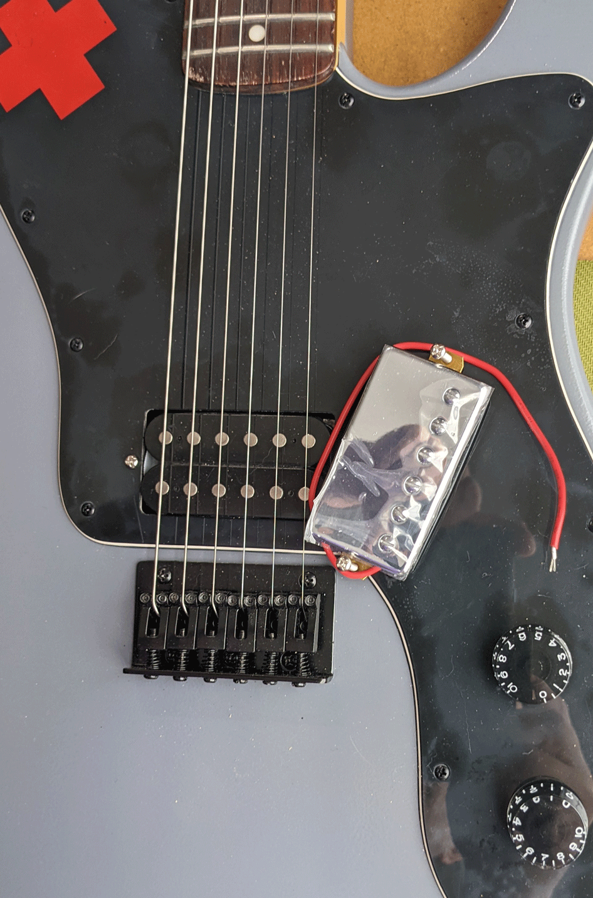
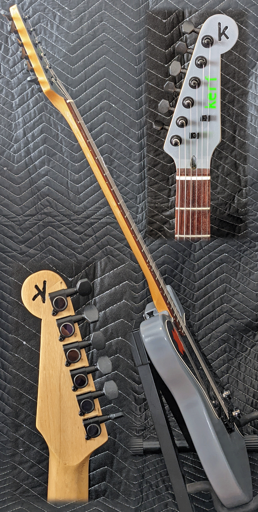

This expermental model was inspired by the work needed to swap pickups on a guitar -- which usually requires soldering.
That's not somehing most folks are familiar with doing, much less have the tools (or experience) to do. Yet many people wonder how
their guitar would sound with different pickups.

What if all you needed was a screwdriver?

We glued a connector terminal under the pickguard and connected it to the pickups. All that's needed to install the pickup
is to insert the stripped end of the pickup's lead wires into the connector block and tighten with a normal screwdriver. 
Put the pickguard and strings back on (same screwdriver), tune it up and away you go.

The guitar is a road warrior we got off Craiglist. As they say, "good bones" but the hardware was a bit worn with some rusty spots.
We stripped it down, refinished it, leveled and crowned the frets, and put all new black hardware on it along with some speed knobs.
It's setup real low and plays like a dream.

The finish is inspired by the Slaid Cleaves song "Primer Gray" <a href="https://www.youtube.com/watch?v=N9Efu83JGY4" target="_blank">(listen on YouTube)</a>, 
whose chorus goes:

<blockquote>
You don't need that flash and shine.
You just need to be hard off the line.
Keep your lacquer, chrome and flames,
I'll paint mine primer gray.
</blockquote>

because I think its owner will care more about finding their tone than how sparkly their guitar is. Learn more about Slaid Cleaves at <a href="https://slaidcleaves.com/" target="_blank">his website</a>.

As a bonus, a second brand new humbucker pickup is included with the leads trimmed and ready to be used. Swap them around, see what you like best, then keep experimenting.

You can start experimenting for just $275 including the extra pickup and a premium gig bag. Delivery can be arranged in the Lowcountry within an hour of Bluffton.

