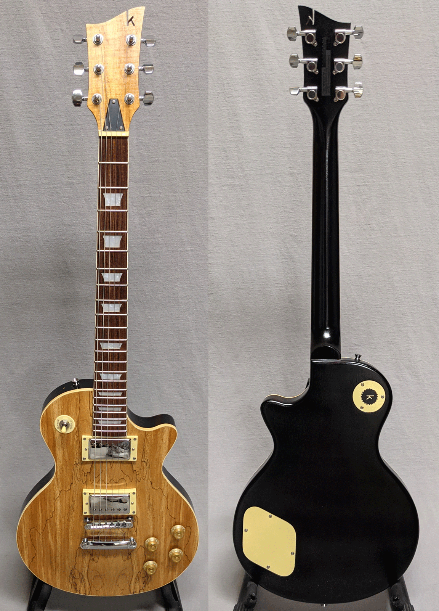
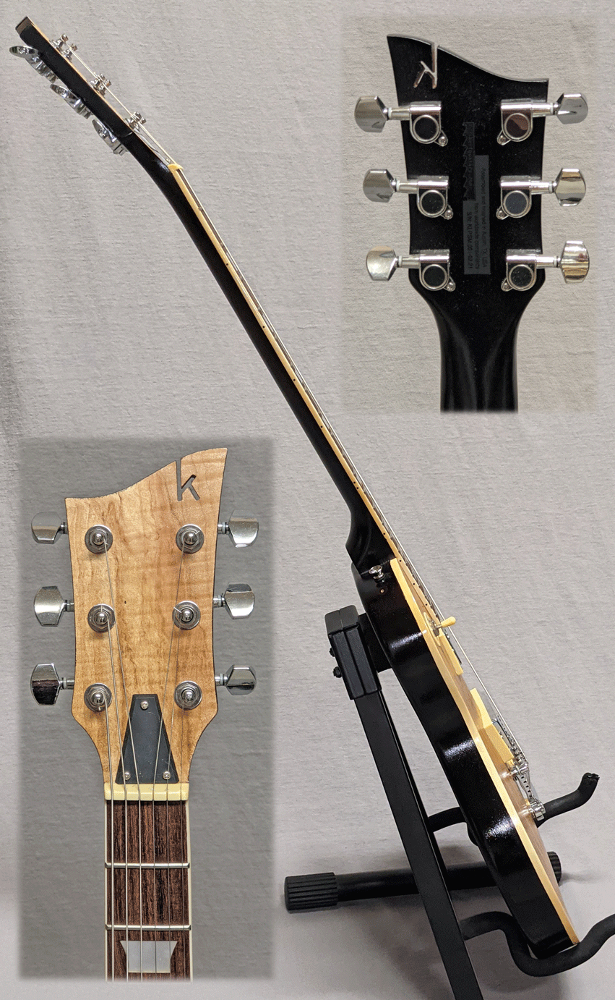

This is the one that started it all. After I built this guitar (link below) and played it, 
I realized I could build a quality guitar and set it up to play really well. Not that kerfs
will ever be collectible, but this is serial number 001, if that sort of thing excites you at all.

It's your basic LP-style guitar, setup beautifully. It is based on <a href="https://www.stewmac.com/kits-and-projects/instrument-kits/electric-guitar-kits/lp-style-electric-guitar-kits" target="_blank"> this kit with finishing set</a> from Stew Mac. Price is $325 and includes premium gig bag.

