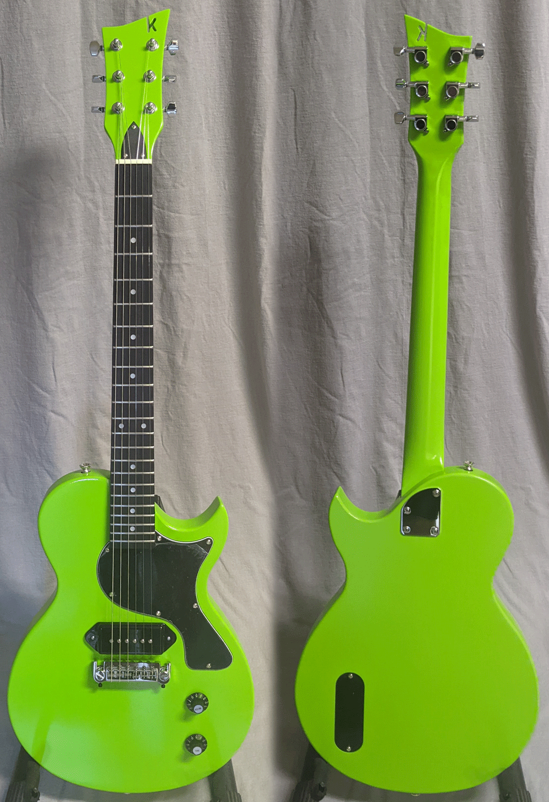
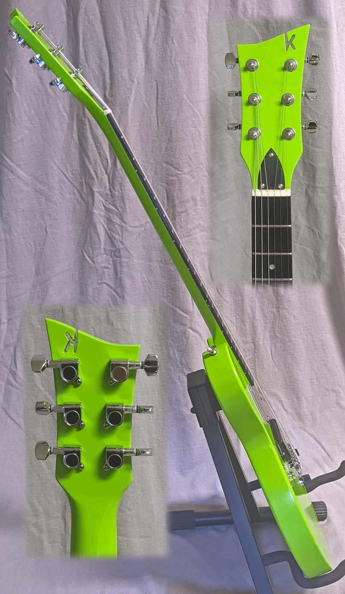

One of the themes at kerfguitars for the coming year is diversity. Getting started, we kept the
number of different models low so we could hone our craft some and build more experience. This 
includes models and approaches to finishing.

This wildly green LP Jr. style guitar features an ebony fretboard and a single P90 pickup in
the bridge position. The Plutonium spray paint (and top coat) provide an industrial-grade finish 
in the sort of colors you typically can't find in traditional lacquers. The highly finished and
polished frets really gleam

I love the sound of a P90 pickup. I think everyone should have at least one guitar with that 
P90 sound. Is this one yours?

It's your classic LP Jr. style guitar, setup beautifully. $275 with premium soft case.

