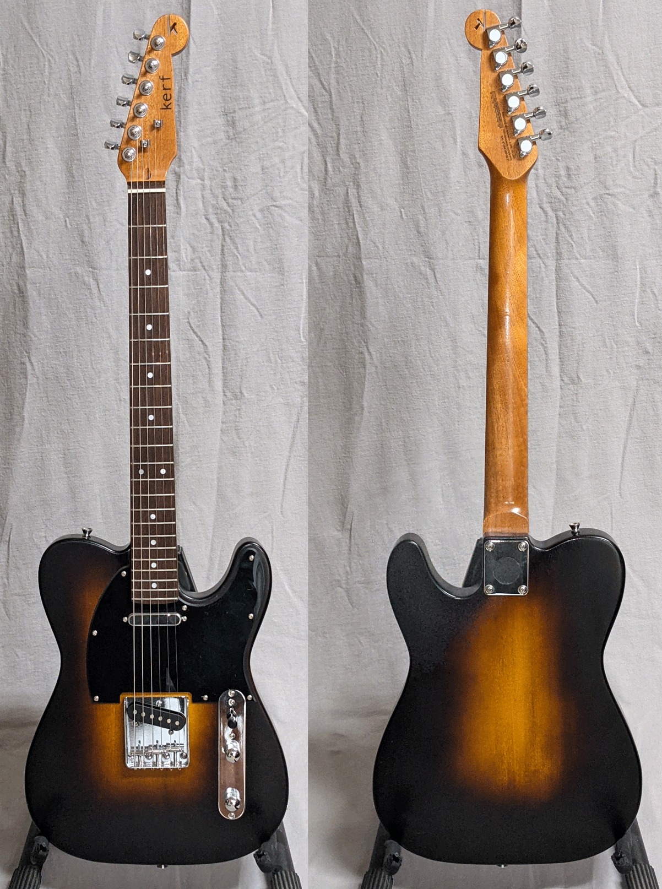
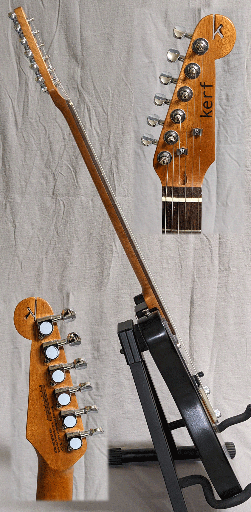

Reminiscent of a vintage micro-burst finish (think 1940s jazz guitar), the deep edges softly and slowly reveal the amber within.
The few people who have seen this guitar in person have called it "beautiful", particularly complimenting the gradient. A professional 
instrument builder friend of mine said "You will sell as many of these as you care to make."

Do you want the first one?

It's your basic Tele-style guitar, setup beautifully. It is based on <a href="https://www.stewmac.com/kits-and-projects/instrument-kits/electric-guitar-kits/t-style-electric-guitar-kit" target="_blank"> this kit with finishing set</a> from Stew Mac. Price is $300 and includes premium gig bag.

