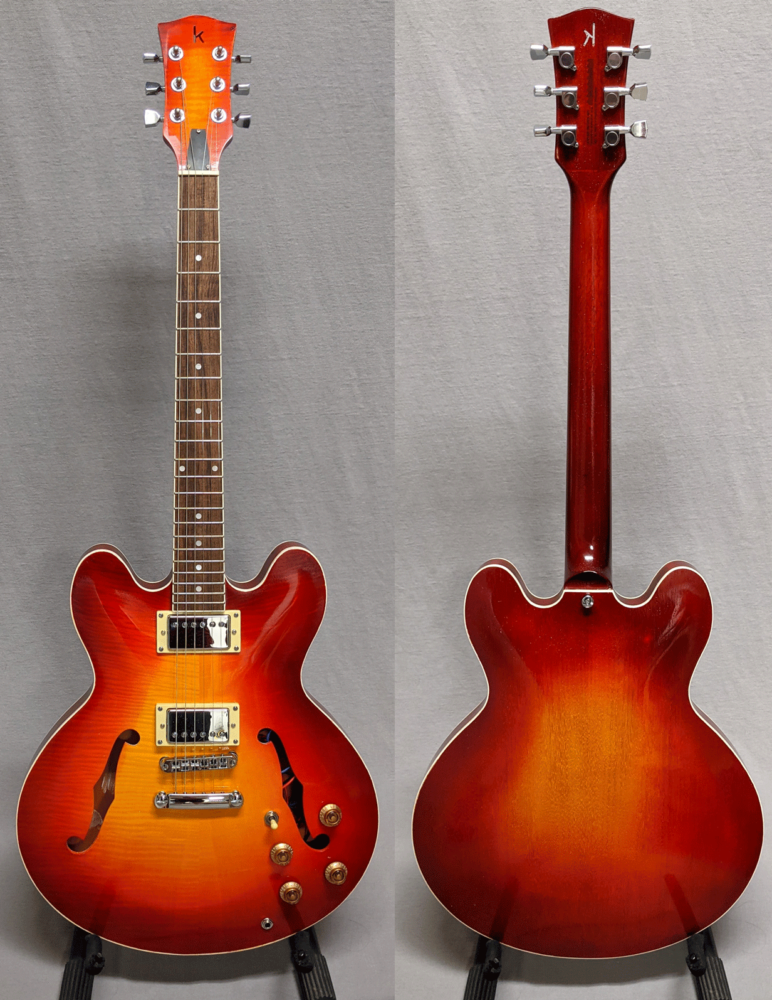
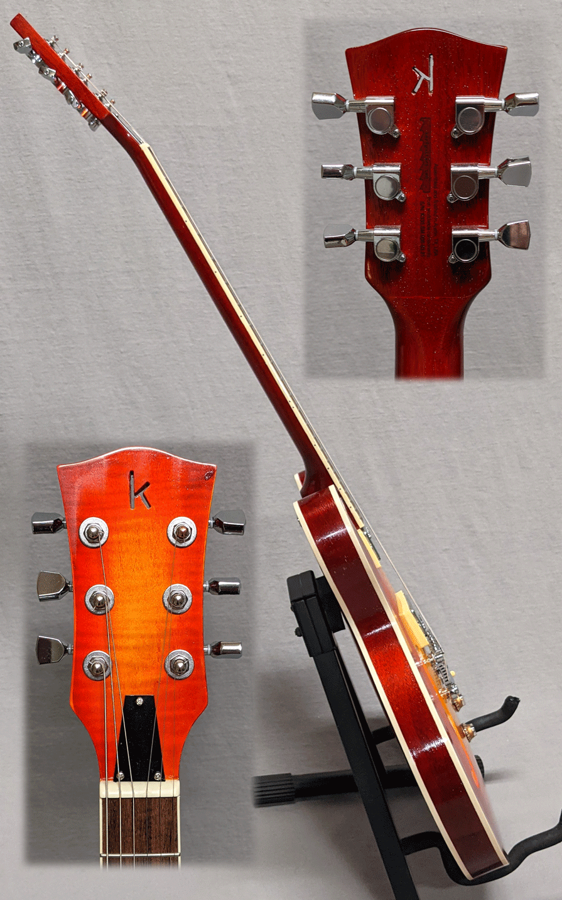

This was our first "335" style build. It might also be our last, as finishing these is a lot of work 
and the kits are a bit pricier (so we have to charge more).
[See the kit at StewMac](https://www.stewmac.com/kits-and-projects/instrument-kits/electric-guitar-kits/335-style-electric-guitar-kit.html). 

So if you like this style, grab it, as it may be the only kerf like this ever made. We're willing to make more 
(it's beautiful and sounds great) but it will definitely depend on interest as we have some lovely LP and Tele 
style guitars coming that are less expensive. Price is $400 (no bag/case currently availalbe, so no shipping). 

We like how the red came out nice and deep at the edges -- easily the best sunburst we've done so far.

