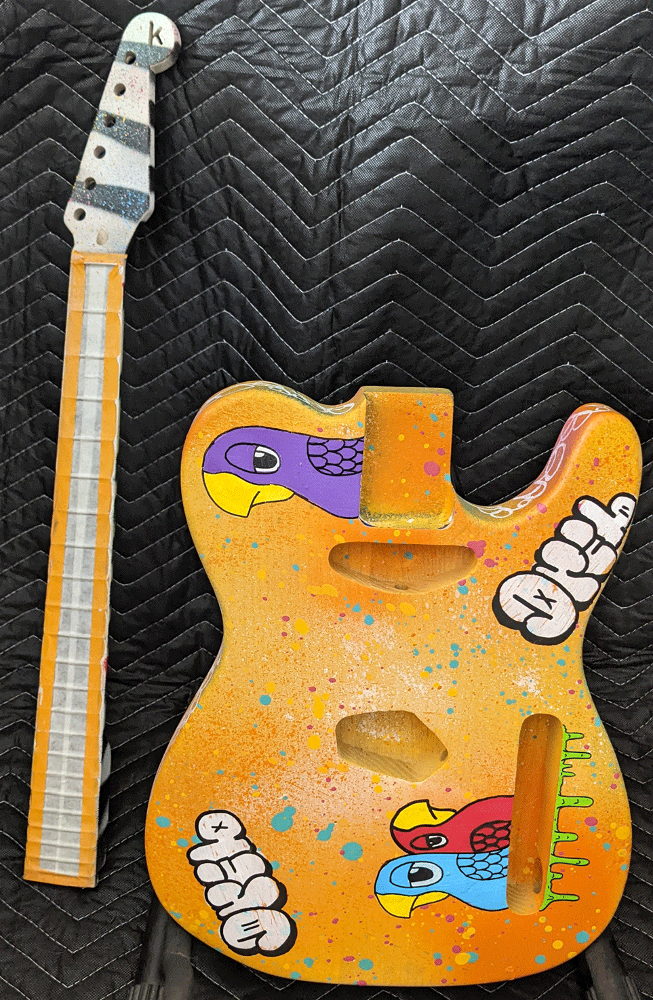
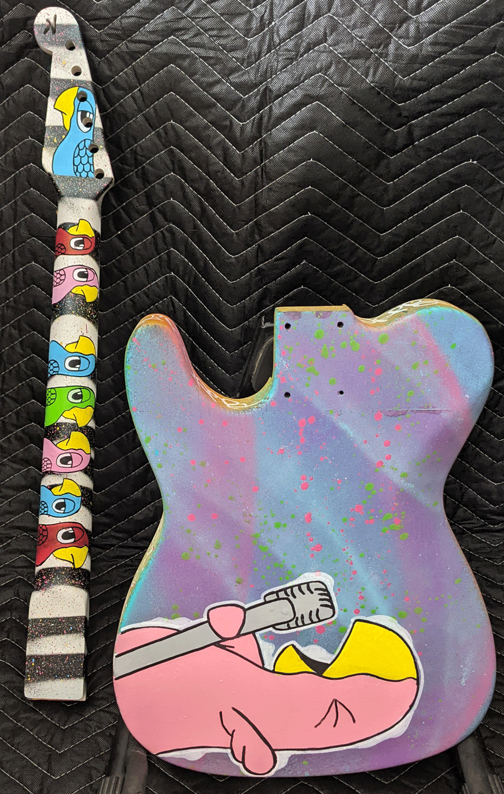

Here's a peek at what's on the bench and should be available soon (if someone doesn't snatch it first).

Something particularly fun and unique is coming together -- our first collab! This one is kerfxdrib, pairing
our typical workmanship and setup with a local artist's take on a painted guitar. In this case, the artist
is local to Austin, TX where the kerf shop used to be.

We still need to do the finishing on this one (that isn't a weird, striped fretboard, it still has its
proective tape on it). Because _cure_ time is much longer than _dry_ time, it will likely be about the
fourth of July before this bird is free to fly away home (maybe yours?). Because of the heavy black areas
in the art, this will likely get all back hardware and probably a bird beak knob or two.

Drib's artwork can be seen around Austin, Texas. The murals feature one or more birds that are typically
accompanied by a postive message. You can learn more about drib via <a href="https://www.instagram.com/this_bird_/" target="_blank">drib's Instagram account</a>
and view (and maybe buy) more artwork at <a href="https://thisbird.bigcartel.com/" target="_blank">the drib shop</a>.

Don't have a price yet. It won't be less than $300. If you are interested, please get in touch and we can 
work out what pickups you want, if you want a 4-way or 5-way switch with some special wiring, etc.

Be sure to [subscribe](http://eepurl.com/hyCJqP) if you want to get an early notification when the kerfxdrib collab drops.

Thanks for stopping by!