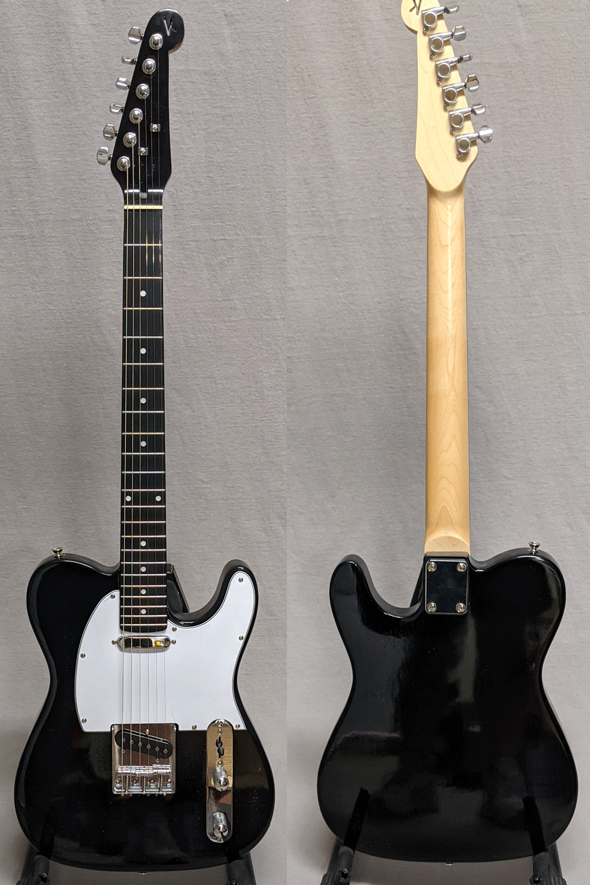
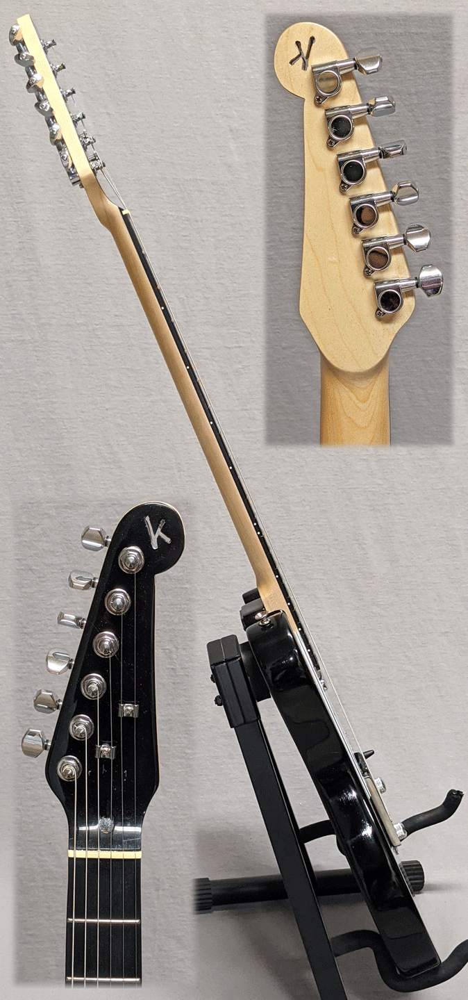

I didn't mean to build this guitar. I was looking to try some other Tele-style kits and put this one in my 
Amazon wish list to come back to. I didn't realize that Amazon was sending my wife an email encouraging her to buy
it for me! A few days later it showed up and I was like "What's this?". They would have taken the return, but since
it was here...

OH! I forgot to lead with the important part: You can have this guitar with gig bag for $200! 

It was a slightly less expensive kit than the StewMac. It did take a little extra love (needed a neck shim, which is not uncommon)
and turned out great. Same low action and attention to detail in the setup. I've owned a Squier Affinity and I'd take 
this over the Affinity any day.

It's your basic Tele-style guitar, setup beautifully. Our neighbor (who is in the jazz guitar program at UT, "hook 'em!")
almost didn't want to give it back after checking it out for us. It is based on <a href="https://www.stewmac.com/kits-and-projects/instrument-kits/electric-guitar-kits/t-style-electric-guitar-kit" target="_blank"> this kit with finishing set</a> from Stew Mac. Price is $275 and includes premium gig bag.

