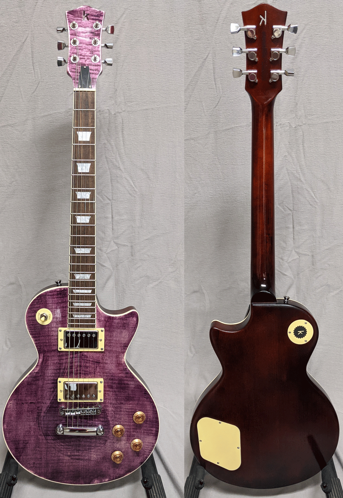
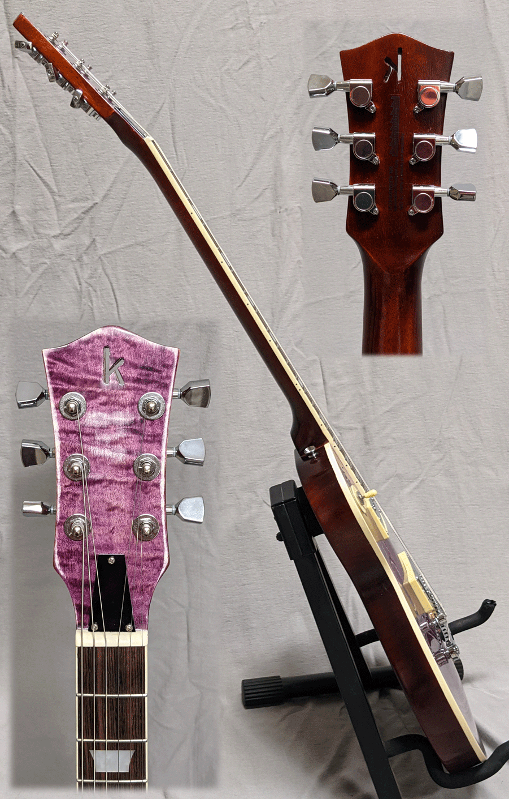
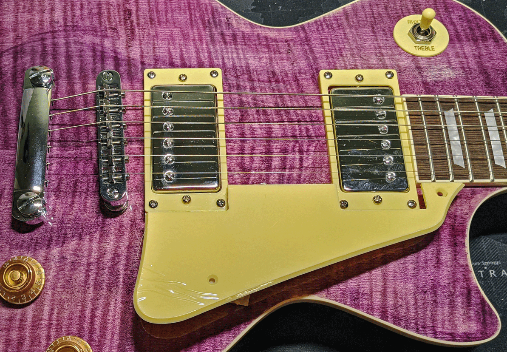

Ever owned a favorite towel or article of clothing made from linen? Did you keep it long enough
that you got to see how interestingly it wears over time? I tried to capture a bit of that with
this "electric violet" finish. As you play it and it continues to age, you'll add your own
accents to how it looks.

It's your basic LP-style guitar, setup beautifully. The rest of the mahogany body has a natural looking
finish that lets some of the wood character show. You just want to hold it (and we suggest you do so for at least 15 minutes each day).
 It is based on 
[this kit with finishing set](https://www.stewmac.com/kits-and-projects/instrument-kits/electric-guitar-kits/lp-style-electric-guitar-kits) 
from Stew Mac. Price is $300 and includes premium gig bag.

Because it requires drilling two more holes (at least one on the top), the pickguard can be installed at your pleasure.
In case it's not your pleasure, we didn't want to put an unnecessary hole in that pretty top.

