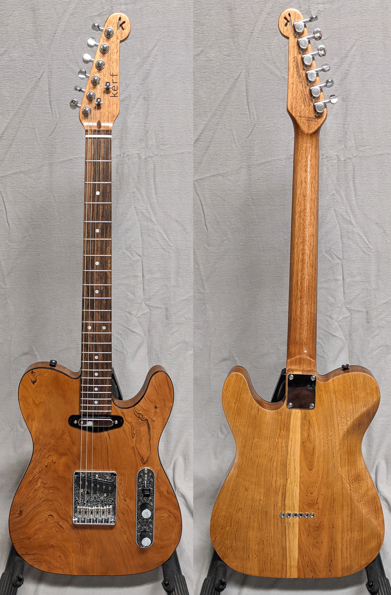
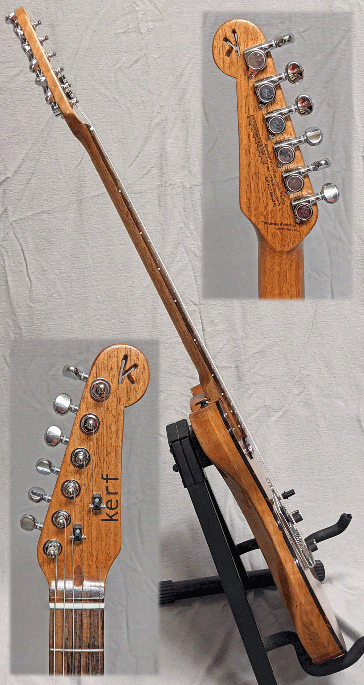
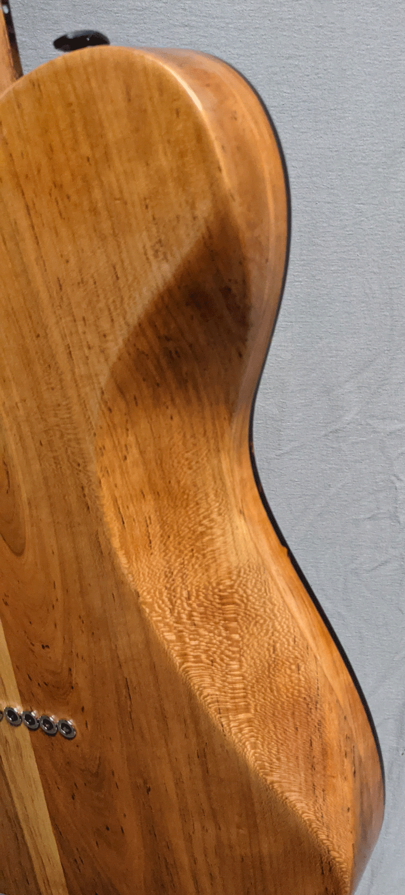
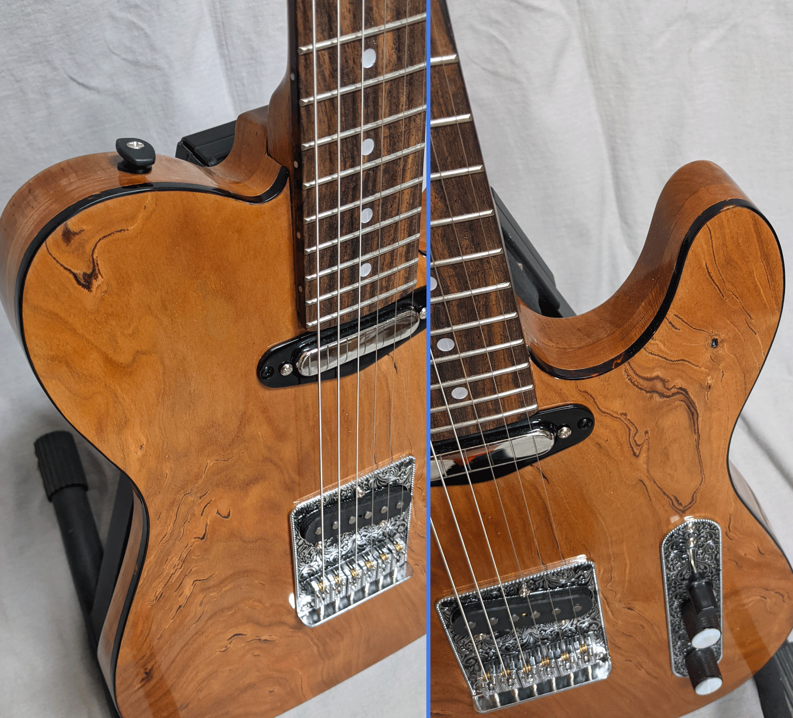

On sale for $300 as part of our Anniversary/President's Day/Valentine's Day combo mashup sale. Guitar only. 

This is the first kerf Custom guitar! We found a nice, cherry wood body for sale on Facebook Marketplace
and picked it up for $150. It needed rejuvenating (so it's almost part-Custom, part-Rescue) so we
sanded it back down and applied a nice, wipe-on poly finish (in many coats). We found a neck, bought
some nice looking hardware and put it all together to make a beautiful guitar.

My professional guitar and bass building friend has played most of the guitars I've built (and bought a couple).
He said "This is the best setup you've done yet. All of your guitars should be like this one."

It's your basic Tele-style guitar, but not from a pre-made kit. Adding up the various parts 
(nice neck with rosewood freboard, good tuners, bone nut, premium hardware) and
finishing costs, this one comes out at $450 including premium gig bag 
(or we can upgrade that to a hard case for another $50).

The body features a full belly-cut that makes it more comfortable to hold close and lowers
the weight of the body a bit.

It may not really come up in the pictures, but the tortoise-like binding really adds a nice touch, 
giving a very refined and finished look to the standard Tele shape. I personally prefer the gripper-style
strap buttons we chose for this build as they've always felt more secure to me.

