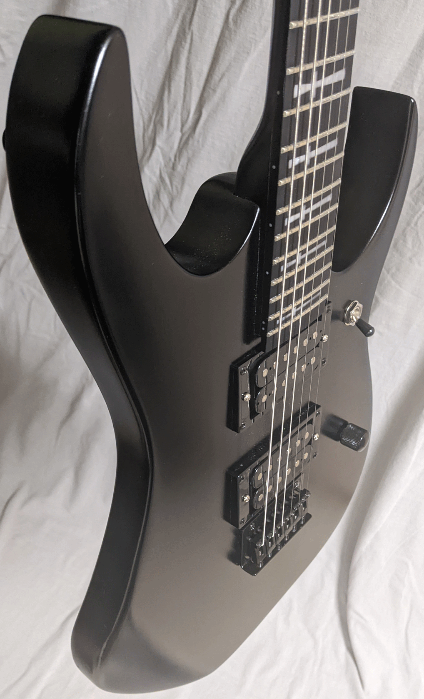

I'm building a guitar very much like this for a Norwegian friend of mine. The kit was of a different style and from a different supplier, 
so I was a little worried about everything working out with my friend's axe. So I bought two. I figured if I messed anything up
or there was anything amiss, I could cover it. But everything went great and now there are two guitars, so one is for sale. 

It is suprisingly light with a thin profile neck that, combined with the ebony fretboard, feels fast and slick.
It has Grover locking tuners, Tony Iommi crosses inlaid in the ebony fretboard, and a pair of humbuckers that sing full-throated all the time.
This thing is so metal, that there is no tone knob. Let your pedals and amp sort it out.

To further enhance it's hard rocking cred, it is strung with GHS Boomer TnTs (Thick and Thins), giving you thick bass strings
for those chugging power chords and normal gauge treble strings to get your weedly-weedly on. Pickup selector has standard configuration -- 
neck-both-bridge. Volume knob does what you'd expect. ;-) 

Priced at $375 with gig bag.

