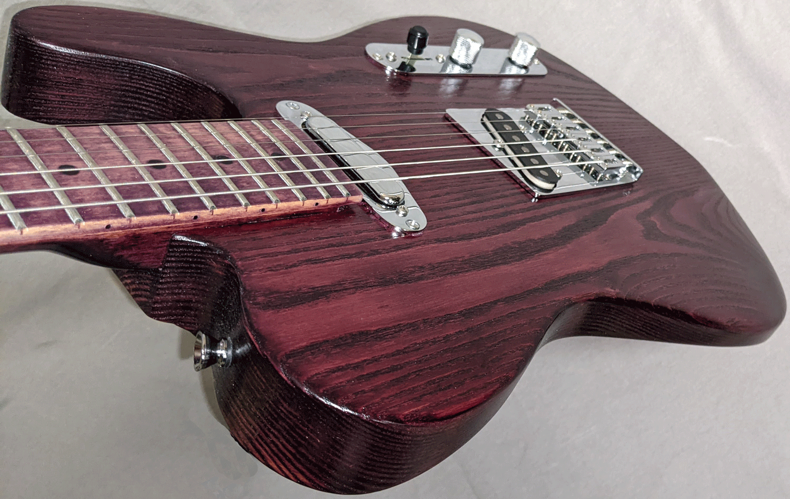
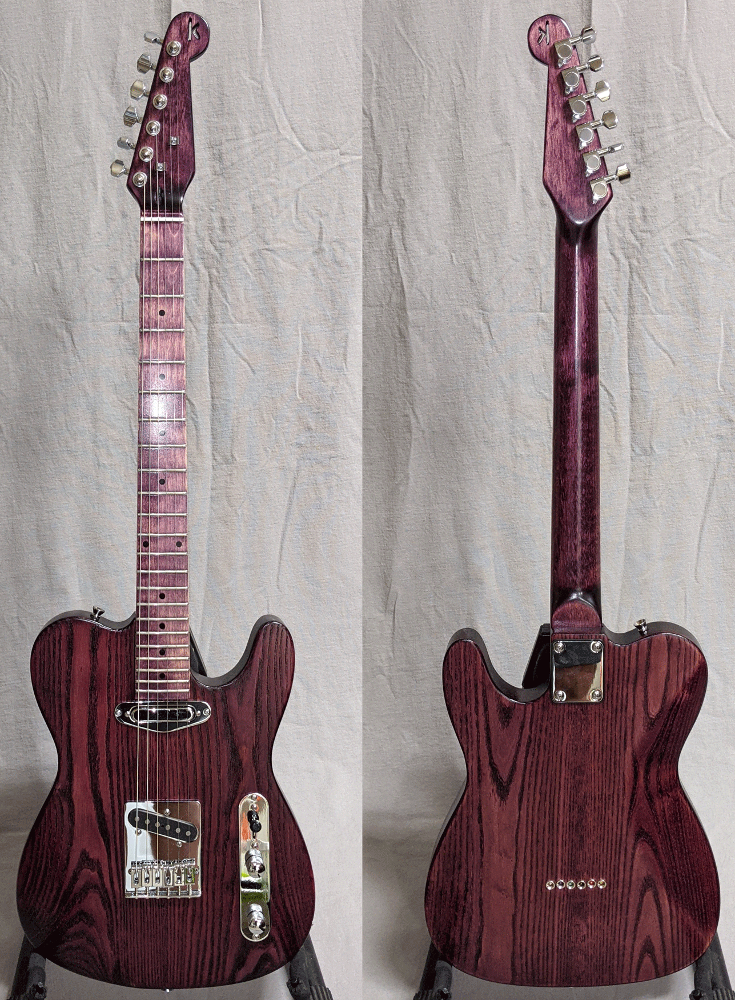
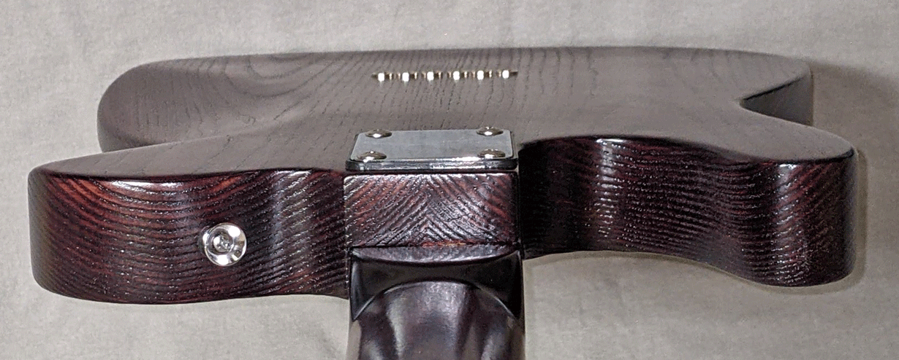
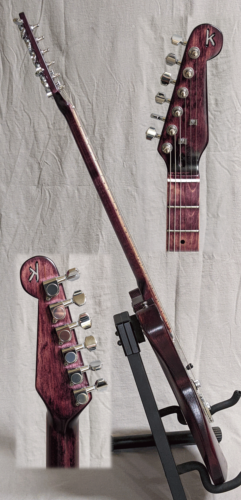
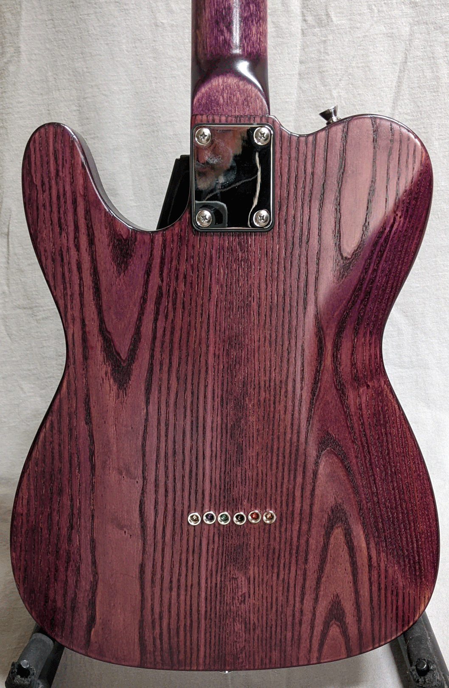

This one is down right regal. That deep purple (technically "electric violet") with the dark American Ash grain tends to look
even better in person than in any pictures (so you'll just need to see it). Consistent with its royal status, it
has upgraded pickups from Bootstrap (made in USA) -- a set of Palo Duros (Palo Duro is also a beautiful canyon in east Texas.)
Follow <a href="https://bootstrappickups.com/collections/t-style/products/bootstrapt-el-paso-vintage-special-for-tele%C2%AE" target="_blank"> this link</a> for pickup details.

To get the most from those pickups, it also has a 4-way switch, offering neck (1) pickup only, (2) neck+bridge in parallel,
(3) bridge pickup only, and (4) neck+bridge in serial. Some say the 4th setting simulates the sound of a humbucker, adding
even more tonal range to your T-style guitar. 

It has comfort features in a belly cut and arm relief (both of which expose the grain in different ways, adding to its attractiveness.)
The modern T-style bridge offers accurate intonation for every string. The 2-piece American Ash body is beautifully bookmatched and finshed satin smooth.

It's your basic Tele-style guitar with American Ash body and maple neck, elevated and setup beautifully. Price is $275 and includes premium gig bag.

I knew you'd want to see the back close up...

